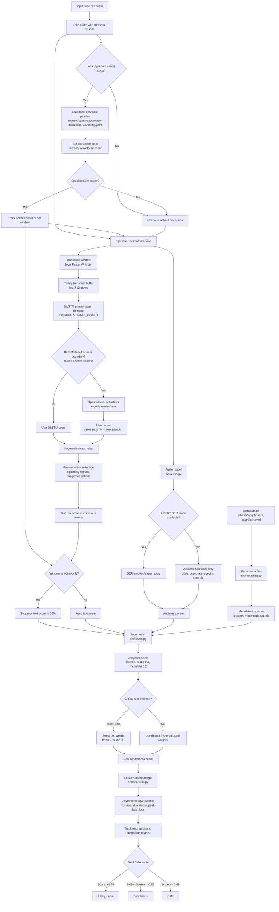

# Current Pipeline Flowchart

Last updated: 2026-05-04

This map shows the current final DontRedeem runtime after reconciling the baseline repository with the newer Codexx implementation.



## Component Map

```text
src/main.py
  orchestrates audio loading, diarization, windows, rolling transcript,
  victim-only suppression, fusion, and final report

src/text.py
  loads Faster Whisper, BiLSTM, optional MiniLM fallback, keyword rules,
  legitimacy checks, and text risk scoring

src/audio.py
  computes acoustic heuristic score and optionally uses HuBERT SER if present

src/metadata.py
  converts call metadata into a risk score

src/fusion.py
  combines audio, text, and metadata scores with overrides/vetoes

src/analytics.py
  applies asymmetric EMA ratchet and tracks session-level evidence

utils_and_tests/benchmark_all.py
  runs the full benchmark over data/*.wav
```

## Runtime Model Hierarchy

```text
Primary scam detector:
  BiLSTM

Optional fallback:
  MiniLM only if BiLSTM fails or lands near the boundary

Removed:
  Gemma 4

Optional environment-dependent modules:
  pyannote diarization
  HuBERT speech emotion recognition
```

