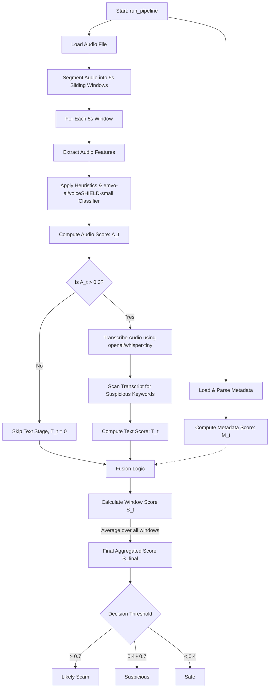
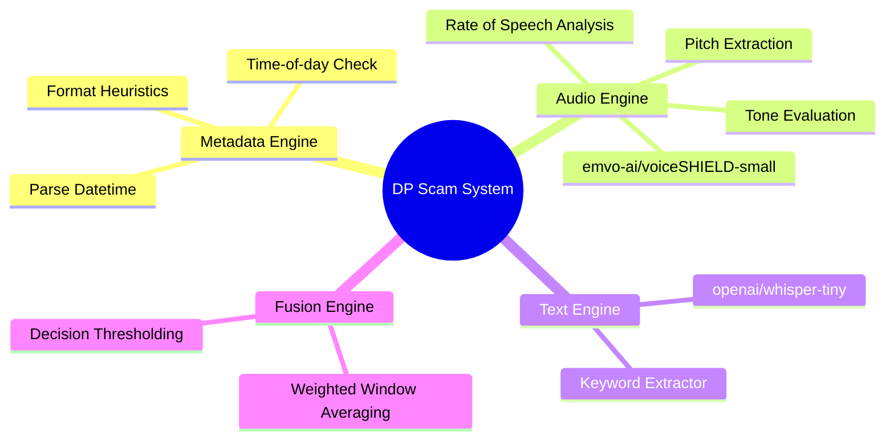

# Product Requirements Document (PRD): DP Scam Detection System

## 1. Project Overview
The **DP Scam** project is an automated, multimodal pipeline designed to detect scam or malicious phone calls. It evaluates real-time or pre-recorded audio against a set of heuristics and AI models to flag potential threats. The system operates on three primary modalities: Metadata, Audio Features, and Transcribed Text.

## 2. Models Used
The system leverages pre-trained Machine Learning models from HuggingFace to perform core inference tasks:
1. **Audio Classification Model:** `emvo-ai/voiceSHIELD-small`
   - **Role:** Analyzes the raw audio waveform to classify tone, stress, or malicious intent present in the speaker's voice.
2. **Automatic Speech Recognition (ASR) Model:** `openai/whisper-tiny`
   - **Role:** Transcribes the speech in the audio into text, allowing the system to perform keyword-based analysis.

## 3. Working Logic & Heuristics
The classification engine evaluates three different confidence scores and fuses them into a final decision metric.

### A. Metadata Logic (`metadata.py`)
- Evaluates the call based on timestamp and caller status format (`dd/mm/yyyy hh:mm, [status]`).
- **Heuristics:** 
  - Unsaved contacts receive higher threat scores.
  - Late-night calls (between 23:00 and 05:00) receive higher threat scores.
- **Output:** Metadata Score `M_t` (0 to 1).

### B. Audio Processing Pipeline (`audio.py`)
- The signal is processed in 5-second sliding windows.
- Extracts features using `librosa`: 
  - **Pitch (Fundamental Frequency):** High pitch (>250Hz) indicates stress/urgency.
  - **Rate of Speech:** Fast speech rate (>4 onsets/sec) indicates urgency.
  - **Tone / Spectral Centroid:** Bright or piercing tones correlate with alert states.
  - **MFCC:** Evaluated for general shape constraints.
- A base score is calculated from the heuristics, which is then weighted (30%) against the `voiceSHIELD-small`'s model prediction (70%).
- **Output:** Audio Score `A_t` (0 to 1).

### C. Text Processing Pipeline (`text.py`)
- **Conditional Trigger:** To optimize performance, the ASR model only runs if the Audio Score for a given window exceeds a threshold of `0.3`.
- Transcript text is evaluated against a list of suspicious keywords (e.g., "bank", "otp", "police", "urgent").
- **Output:** Text Score `T_t` (increases by 0.25 per keyword found, capped at 1.0).

### D. Fusion & Decision (`fusion.py`)
- All window scores are fused using predefined weights:
  `S_t = (0.5 * A_t) + (0.3 * T_t) + (0.2 * M_t)`
- The final score `S_final` is the average of all window scores `S_t`.
- **Decision Thresholds:**
  - `> 0.7`: Likely Scam
  - `0.4 - 0.7`: Suspicious
  - `< 0.4`: Safe

## 4. Workflow Flowchart & System Architecture

### Pipeline Flowchart

### Component Tree Diagram

The workflow executes as follows:

1. **Initialization:** The script `main.py` begins by extracting metadata features and calculating the global Metadata Score `M_t`.
2. **Audio Loading:** The audio file is loaded and sampled at 16kHz (optimal for Whisper).
3. **Sliding Window Stream:** The audio is segmented into 5-second overlapping chunks. For each chunk:
   1. **Audio Stage:** Extract pitch, rate, and tone. Feed chunk into audio classifier. Return Audio Score `A_t`.
   2. **Gating Mechanism:** Is `A_t > 0.3`?
      - **No:** Skip the text stage. `T_t = 0`.
      - **Yes:** Feed the chunk into Whisper to get a transcript. Scan transcript for suspicious keywords. Return Text Score `T_t`.
   3. **Fusion Stage:** Calculate the fused score `S_t` for the current window.
4. **Aggregation:** Average all gathered local `S_t` scores across the entire audio length.
5. **Decision Output:** Map the final average score to "Safe", "Suspicious", or "Likely Scam" and print out the reasoning logs (e.g., detected keywords, fast speech rate, late night call inference).
