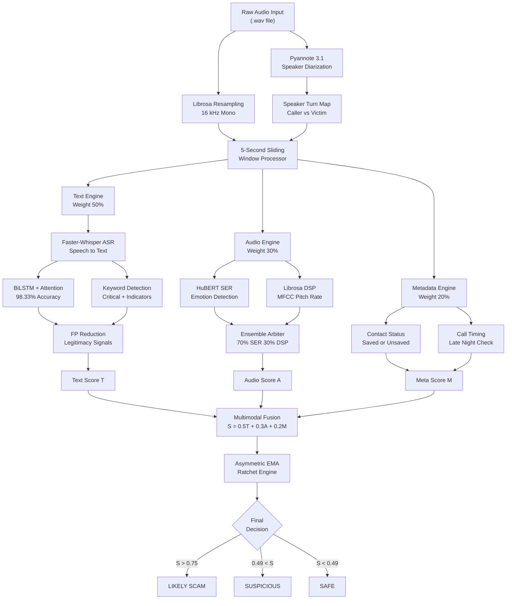
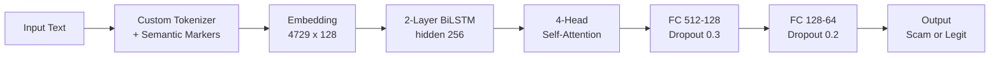
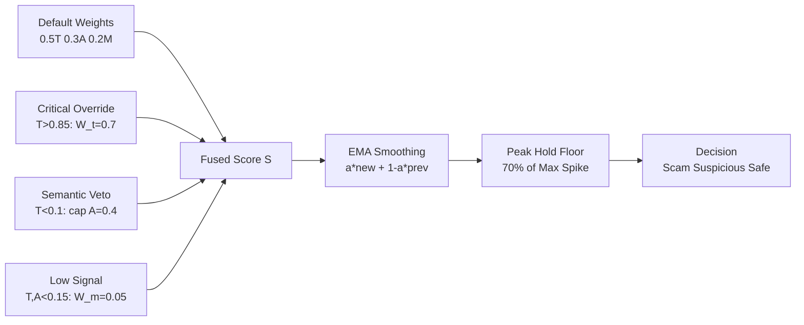

# Zero-Trust Scam Detection Overlay — System Workflow

## Complete Pipeline Network Map



---

## How It Works — Step by Step

### Stage 1: Audio Ingestion
The pipeline receives a raw `.wav` audio file. **Librosa** resamples the audio to 16 kHz mono format for consistent processing across all downstream models.

### Stage 2: Speaker Diarization
**Pyannote 3.1** analyzes the audio to identify and separate speakers. This produces a speaker turn map that distinguishes the **caller** (potential scammer) from the **victim**. This is critical because the system must suppress threat scoring when only the victim is talking to avoid false positives.

### Stage 3: Sliding Window Processing
The audio is divided into overlapping **5-second chunks**. Each chunk is independently processed through three parallel analysis engines. This sliding window approach enables real-time processing and temporal tracking of threat levels across the call.

### Stage 4: Three Parallel Engines

**Text Engine (50% weight):**
- Faster-Whisper ASR transcribes speech to text
- BiLSTM with 4-head attention classifies scam probability (98.33% accuracy)
- Critical keyword detector flags terms like "deport", "emirates id", "arrest"
- False positive reduction logic checks for legitimacy signals (job offers, business emails)

**Audio Engine (30% weight):**
- HuBERT SER transformer detects emotional states (anger, stress)
- Librosa extracts acoustic features: MFCC, pitch (>280 Hz = stress), onset rate (>4.5/s = urgency), spectral centroid
- Ensemble arbiter combines SER (70%) with DSP heuristics (30%)

**Metadata Engine (20% weight):**
- Checks if the caller is a saved contact (+0.5 if unsaved)
- Checks call timing (+0.5 if late night between 23:00–05:00)

### Stage 5: Multimodal Fusion
The three engine scores are fused using the weighted formula:

```
S(t) = 0.5 × T(t) + 0.3 × A(t) + 0.2 × M
```

Dynamic adjustments apply:
- If text score > 0.85 → text weight increases to 0.7 (critical text override)
- If text score < 0.1 → audio capped at 0.4 (semantic veto)
- If both audio and text < 0.15 → metadata weight drops to 0.05

### Stage 6: Asymmetric EMA Ratchet
The fused score passes through an Exponential Moving Average smoother (α = 0.5) that:
- **Escalates rapidly** on threat spikes
- **Decays slowly** on safe segments
- Maintains a **peak-hold floor** (70% of max spike) so scammers cannot dilute the final score by adding safe silence at the end

### Stage 7: Final Decision
```
S > 0.75  →  LIKELY SCAM
0.49 < S ≤ 0.75  →  SUSPICIOUS
S ≤ 0.49  →  SAFE
```

---

## BiLSTM Model Architecture



The tokenizer injects semantic marker tokens like `[URGENT]`, `[MONEY]`, `[THREAT]`, `[VERIFY]`, and `[PERSONAL]` based on detected patterns in the input text. These markers give the BiLSTM additional context about the type of language being used.

---

## Fusion Logic Detail



---

## Edge Case Countermeasures

| Attack Vector | System Response |
|---|---|
| **Temporal Evasion** — adding safe silence to dilute score | Asymmetric EMA ratchet locks onto spikes, refuses full decay |
| **Victim False Positives** — victim's own stressed speech | Pyannote diarization suppresses scoring on victim-only segments |
| **Cold-Tone Intimidation** — calm/polite scammer voice | Text weighted at 50%, semantic intent detected regardless of tone |
| **Fast-Talking Evasion** — confusing ASR with rapid speech | Librosa onset rate > 4.0/s triggers urgency penalty independently |
| **Fake Job Scams** — "congratulations, send your passport" | Dangerous action keywords override legitimacy signals |
